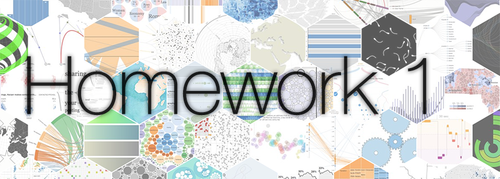
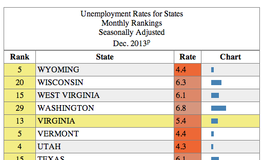
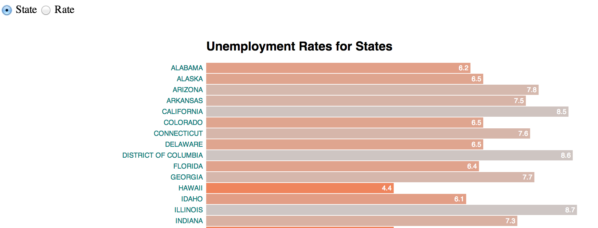

*This homework is due on Thursday, February 13th 2014 at 11:59 pm.*

In this homework, you will use [D3.js](http://d3js.org/) to create an interactive data table and a bar chart. D3 stands for "Data Driven Documents." It is a library for JavaScript that is very useful for creating interactive visualizations, but D3 can be used to achieve many tasks that other libraries — like JQuery — also enable. This homework assumes that you have read and coded along with Chapters 1-8 in [D3 - Interactive Data Visualization for the Web](http://www.amazon.com/Interactive-Data-Visualization-Scott-Murray/dp/1449339735/ref=tmm_pap_title_0) by Scott Murray. See the [Readings Page](http://www.cs171.org/#!readings.md) for access to free online copies. 

We use data collected and published by the [U.S. Bureau of Labor Statistics](http://www.bls.gov/). The Bureau defines itself as follows:

>The Bureau of Labor Statistics is the principal fact-finding agency for the Federal Government in the broad field of labor economics and statistics.

Unemployment data are regularly published on a specific [BLS web page](http://www.bls.gov/web/laus/laumstrk.htm).

The Bureau of Labor Statistics released, for example, [a statement](http://www.bls.gov/news.release/empsit.nr0.htm):

>The unemployment rate declined from 7.0 percent to 6.7 percent in December, while total nonfarm payroll employment edged up (+74,000), the U.S. Bureau of Labor Statistics reported today. Employment rose in retail trade and wholesale trade but was down in information."

In this homework, we will explore how this unemployment is broken down by state. Below is a brief sample of this data (Nov. 2013., but data on the page are more recent):

| Rank |      State   | Rate |
| ---- | ------------ | ---- |
|  1 	 | NORTH DAKOTA | 2.6  |
|  2	 | SOUTH DAKOTA | 3.6  |
|  3	 | NEBRASKA	    | 3.7  |
|  4	 | UTAH	       | 4.3  |

This is essentially a one dimensional dataset — seems simple enough. We will stick to this dataset, and explore the visualization options for such a tiny and simple dataset. Along the way, you will pick up the D3 skills necessary to tackle bigger and more complex datasets. 

### Formalities

Ensure you respond to questions in the appropriate text file (as described in the subheading for each section). You can use [Markdown](https://en.wikipedia.org/wiki/Markdown) to format your answers. Follow [the instructions](https://piazza.com/class/ho6118hjjnr6u6?cid=29) on Piazza for cloning the repository.

We recommend that you name your GitHub repository following this convention: 

```
cs171-hw1-lastname-firstname
```

Share it with `cs171tf` and your grading TF (we will tell you who this is in time), clone it and then copy the files of HW1 to your repository. Use the file templates provided for your answers and your code. *It's important that you don't fork the repository and put your solutions in it, since you can't make a fork of a public repository private.*

Refer to the [CS 171 web page](http://www.cs171.org/#!homework.md) for more information on how to submit your homework.

In case you find an error in this homework, you are welcome to fix the error (open this file on Github and click "edit" in the top right corner) and submit a pull request!


### Introductory Questions

*Answer the questions in [intro_answers.md](intro_answers.md).*

1. If we were interested in understanding summary statistics at a glance (minimum, maximum, etc.), how could you improve the display of the table?
2. Find three varied examples on the web that present tabular data in a different layout or in more visually compelling, complete, interactive or interesting ways.

## Problem 1: Analyze an HTML Data `<table>`
*Answer the questions in [problem_1_answers.md](problem_1_answers.md).*

The unemployment data available on the BLS website are accessible as an HTML table, located at the following URL:

>[http://www.bls.gov/web/laus/laumstrk.htm](http://www.bls.gov/web/laus/laumstrk.htm)

Each row represents a state; columns represent the rank, the state's name and the rate of unemployment. Using such a format is common for publishing raw data. However, as you may have noticed during the warm up, tables are not well suited for analysis by humans. For example, finding the minimum and maximum values takes time and requires to scroll as the table is long. Or finding a state if the table is not in alphabetical order also takes time.

Now take a detailed look at how this table is structured:

* Open the DOM inspector in your browser (see [Scott Murray Book](http://chimera.labs.oreilly.com/books/1230000000345/index.html)). As a reminder, the DOM element has a tree structure: identify the subtree corresponding to the table, its root and leaves.
* Open the source code of the page and locate the source HTML of the table.

### Questions

When looking at the table's DOM or source code:

1. What does the `colspan="3"` attribute of the `<th>` node do?
2. List all the styles (e.g. border width, text alignment, etc.) applied to the `th` element containing "Rank". For each, state whether they are set as an HTML attribute or a CSS style and describe them in a few words. Include only styles directly applied to the element, not styles inherited/cascading from parent elements or styles from the default user agent stylesheet. Exclude overwritten styles. For HTML attributes, state the CSS equivalent.
3. What differences do you notice between the DOM inspector and the HTML source? Why would you use the DOM inspector? Why is the HTML source useful?

## Problem 2: Table Replication
*Implement the features in the provided [table.html](table.html) file*

Creating a table similar to the one on BLS can be done manually with a simple text editor. However, you'd need to go through the same tedious process every time the data is updated. We can do better. Let's create a table dynamically using D3 and the data we provided. As a reminder, D3 is not *just* a visualization framework: it's simply designed to help manipulate DOM elements (hence the name "Data Driven Documents"). It's well suited for such a task, in spite of there being no visualization involved (yet).

Your final result should look somewhat like this:

<p align="center">

</p>

To get started, 

* Brush up on your knowledge of the HTML `<table>` element. See the MDN [developer guide](https://developer.mozilla.org/en-US/docs/Web/Guide/CSS/Getting_started/Tables) and [reference](https://developer.mozilla.org/en-US/docs/Web/HTML/Element/table) on the topic. As is common with real world data, the source BLS page may use incorrect tags or use non-standard features or incorrectly formatted HTML. We expect valid, standards-compliant HTML for your submission.
* Inspire yourself from the [this Gist](http://bl.ocks.org/romsson/8609118).

We extracted the data from the table and put it in the file [unemp_states_us_nov_2013.tsv](unemp_states_us_nov_2013.tsv).

Because of the [same-origin policy](https://developer.mozilla.org/en-US/docs/Web/JavaScript/Same_origin_policy_for_JavaScript), you'll need a running local web server. Open a terminal window, change directory to the folder containing `table.html` and run:

```
python -m SimpleHTTPServer
```

You'll see your page at [http://localhost:8000/table.html](http://localhost:8000/table.html). Note that you'll need to have Python installed (you probably already do if you're on Linux or Mac OS). For more details on how to set up a local web server, refer to [CH4](http://my.safaribooksonline.com/book/web-design-and-development/9781449340223/4dot-setup/id452833) of [*Interactive Data Visualization*](http://my.safaribooksonline.com/book/web-design-and-development/9781449340223).

### Implementation Tasks

1. The `d3.tsv()` function skips headers (the first row), but that row contains important information. Replace the `d3.tsv()` call with `d3.text()` and use the lower-level `d3.tsv.parseRows()` to parse the TSV (see the [documentation](https://github.com/mbostock/d3/wiki/CSV#wiki-tsv)).
2. Add column headers `<thead>` to the DOM, with the headers you just collected in it. It is constructed the same way as the `<tbody>` elements, but rows use `<th>`.
3. Use D3 to dynamically add an `<h1>` element matching the title of the BLS page and a `<caption>` element for table header title. The text values for these can be hardcoded in your Javascript.
4. Apply similar table and H1 styling to that used on the BLS website (border, font, etc.). Feel free to cosmetically improve the layout of the page (eg. by adding a background or centering the table). Ensure to use CSS and standards-compliant HTML (<a href="http://validator.w3.org/">HTML validator</a> and <a href="http://jigsaw.w3.org/css-validator/">CSS validator</a>).
5. Add zebra rows to the table (i.e. rows with alternating color for increased legibility). Do this only with D3 without using the `:nth-child(n)` CSS selector.
6. When hovering over a cell, use a yellow shade to highlight *both* the row and the column of the cell without using the CSS `:hover` selector. You'll find that it's more tricky to highlight the column.

## Problem 3: Table Sorting
*Continue working on [table.html](table.html).*

Dynamically sorting rows (by ascending or descending order) is a simple yet powerful technique to efficiently organize data and find minimal or maximal values on one dimension. We provide you with code samples to make an interactive HTML table and to color cells by rank.

Here is a function that compares two values, and returns `1` if a is greater than b, `0` if a equals b, and `-1` if b is greater than a.

```javascript
function ascending(a, b) {
  return a > b ? 1 : a == b ? 0 : -1;
}
```

This function is part D3 and can be invoked with [`d3.ascending()`](https://github.com/mbostock/d3/wiki/Arrays#wiki-d3_ascending)

The next function, `.sort()`, changes the order of the DOM of the elements. It iterates over all pairs of elements, passing the two elements to the compare function (see the [documentation](https://github.com/mbostock/d3/wiki/Selections#wiki-sort)).

For example, this snippet would sort the table alphabetical by state (actually, it will sort it [*lexicographically*](https://en.wikipedia.org/wiki/Lexicographical_order)):

```javascript
tbody.selectAll("tr").sort(function(a, b) {
  return d3.ascending(a[1], b[1]);
});
```

We now use the sorting function to reorder the table. As you may have noticed, an HTML `<table>` vertically orders rows according to their relative position in the DOM. For instance, NORTH DAKOTA is above SOUTH DAKOTA because it appears before it in the DOM. Changing their DOM position will change their Y-position on the screen.

### Implementation Tasks

* Use the above code to trigger a state column sort with a click to the State `<th>` cell.
* Similarly, provide functionality such that the rate column is sorted when the respective header cell is clicked. (tip: make sure you are comparing floats, not strings, else the behavior will be subtly wrong)
* Note that sorting by Rate can result into ties, causing random and inconsistent sorting. For instance, MISSOURI and TEXAS have a rate of 6.1. Use the alphabetical state order to solve this issue. See the [documentation](https://github.com/mbostock/d3/wiki/Arrays#wiki-ordering) for additional information.
* Ensure that zebra row coloring developed in the previous problem is maintained after sorting.
* Reverse the sorting when the user clicks twice on the same column. Use reverse alphabetical order to break ties (ie. descending sort should be the exact opposite of ascending sort).
* On load, sort by rate in ascending order. This happens to be the same order as the source data, but don't assume the source data is sorted.
* Use CSS to change the cursor shown when hovering over the table headers. Use `cursor: s-resize` if clicking will trigger an ascending sort and `cursor: n-resize` if it will trigger a descending sort.

## Problem 4: Rank Colors and Bar Chart
*Continue working on [table.html](table.html). Answer the questions in [problem_4_answers.md](problem_4_answers.md).* 

Let's color cells according to their sorted position. This will be your first visual encoding of data... yeah! Below is sample code that creates a color scale. Note this is a linear scale ([documentation](https://github.com/mbostock/d3/wiki/Quantitative-Scales#wiki-linear-scales)) since we are mapping numerical values to color.

```javascript
var color = d3.scale.linear()
  .domain([0, tbody.selectAll("tr")[0].length-1])
  .interpolate(d3.interpolateRgb)
  .range(["orangered", "silver"])
```

### Questions
1. The `domain()` function is the data range upon which the scale is calculated. What does `d3.selectAll("tbody tr")[0].length-1` mean?
2. Add the snippet in your code. Describe, in words, what the following function calls return: `color(0)`, `color(10)` and `color(150)`?
3. If the array passed to `domain()` was the minimum and maximum rate values, how would that change the scale? In what situations would this be appropriate?

### Implementation Tasks

* Use the scale described above to set the background color of the Rate column based on the position of the row (lowest rate should be red).
* Make the modifications described in question 3 above (ie. so that the column is colored by rate) and update the relevant code that references the scale.

The code below adds an extra column to the table, containing a horizontal bar with a width that is proportional to the rate value:

```javascript
rows.insert("td").append("svg")
   .attr("width", width)
   .attr("height", height)
   .append("rect")
   .attr("height", height)
   .attr("width", function(d) { return parseFloat(d[0]); });
```

* Set suitable numerical values for `width` and `height`.
* Insert the snippet into your code, add a heading and sorting functionality to this column.

## Problem 5: Interactive Horizontal Bar Chart
*Implement the bar chart in [bar.html](bar.html). Answer the questions in [problem_5_answers.md](problem_5_answers.md)*



We are now going to create a horizontal bar chart with its own layout. The bars will be encoded will be similar to the chart column of the previous problem, but this time you will have to create your own layout by setting the bar groups' `x, y` positions.

### Bar Chart Creation

Let's first define the perimeter of the visualization canvas and the position on the chart within this canvas. Following D3's [margin convention](http://bl.ocks.org/mbostock/3019563) we define the following parameters:

```javascript
var margin = {top: 50, bottom: 10, left:300, right: 40};
var width = 900 - margin.left - margin.right;
var height = 900 - margin.top - margin.bottom;
```

Let's now define the vertical position for each bar. We define it as a linear scale `yScale`. The bars' width will be defined by `xScale`.

```javascript
var xScale = d3.scale.linear().range([0, width]);
var yScale = d3.scale.ordinal().rangeRoundBands([0, height], .8, 0);
```

### Questions

Consider the provided sample code [this Gist](http://bl.ocks.org/romsson/8639620) and answer the following questions:

1. What's missing? Is this bar chart usable in its current form?
2. What is the role of each of the three nested levels of `g` elements? (keep in mind you'll be adding a title to the chart)
3. Complete the implementation section below. Is there any consequence if you add the `text` elements before or after the `rect` elements? Why?

### Implementation Tasks

To make the chart more useful, let's add some text labels. Below is a code example showing how add a text node within the same SVG group as  the bars:

```javascript
groups.append("text")
        .attr("x", function(d) { return xScale(d.Rate); })
        .attr("y", function(d) { bar_height/2; })
        .text(function(d) { return "your text"; })
```

Open `bar.html` and add two different labels:

* Row names (ie. state names), which you should put to the left of each bar
* Row values (ie. rank values), will be located within the bar, but at its right end.

Tip: the `text-anchor` attribute may come handy and you might want to look at `dx` and `dy` attributes for [relative positioning](http://www.w3.org/TR/SVG11/text.html#TSpanElementDXAttribute).

Finally, add a title centered at the top of the chart chart using a `text` element.

#### Reordering Rows Dynamically

Your next task is to reorder the chart, similarly to what you did for the table. You now have more flexibility than before since SVG elements can be freely moved in the 2D space by setting their coordinates. However, we have to manually manage the `x, y` position of all the elements or groups of elements.

First, let's add form elements to control the chart's order. Form elements are useful, as they have a familiar affordance (i.e., users know how they work) and their state is visible. Add the following buttons to your bar charts.

```html
<label><input type="radio" name="order" value="state"> State</label>
<label><input type="radio" name="order" value="rate" checked> Rate</label>
```

Moving bars requires to change their coordinates. If you remember the HTML table, we only had to sort the `<tr>` nodes to visually re-organize the table. But now, `rect` elements in SVG are only displayed based on their `x, y` coordinates. You can use the following strategies to change the position of the bars:

* Change the coordinates (but not the data).
* Change the data (and by consequence the coordinates).
* Change the scale function to reflect the new order.
* Change the relative position `(dx, dy)` of the element.
* Translate the coordinates `attr("transform", "translate(x, y)")` (which does not change the `(x, y)` but moves ("translates") the element).

We are going to use a data-driven approach and change the bars position using an SVG translation (`attr("transform")`).

* Create a function `reorder()` which is triggered every time the user clicks on a form element (`d3.selectAll("input").on("change", reorder);`)
* Implement the `reorder()` function as follows:
  * Sort the source `data`. You may reuse previous sorting code you developed (ensure that your correctly break rate ties)
  * Translate the bars by completing and using the code snippet below:

```javascript
bars
   .transition()
   .duration(750)
   .delay(function(d, i) { return i * 10; })
   .attr("transform", function(d, i) { return "translate("+ ?? +", "+ ?? +")"; }) 
```

* Toggle the sort order (descending/ascending) when the user clicks again on the same radio button. (tip: listen to `click` event instead of the `change` event).
* Apply the color scale of the previous problem to the bars (use the final scale we developed: the one based on data range).

That's it, you have created your first D3 visualization. Congratulations! If you're looking for more, you can continue with the bonus problem. 

## Bonus Problem
*Put your bonus implementation in the files [bonus_table.html](bonus_table.html) and  [bonus_bar.html](bonus_bar.html). Use your previous solution as the basis. If you complete all the steps, you will get 0.5 points extra.*

### Table Upgrade
* Insert the bar chart column in the table as the first column instead of the last one (see [parameters](https://github.com/mbostock/d3/wiki/Selections#wiki-insert) of the `insert()` function)
* Add an icon of an arrow pointing up and downwards (as appropriate) next to column header for which the currently sorted column.

### Bar Chart Filtering
Filtering is an important feature to visually reduce the number of displayed objects. It lets the user focus on elements which correspond to a criteria. The markup below adds a slider to the page (ensure you have a modern browser, since this is HTML5 functionality that won't work in <IE10):

```html
<input type="range" name="points" min="0" max="50" step="1" value="50">
```

* Filter the bar chart to the top-k elements, where k is the slider's value. 
* If a bar disappears because it is below the filtering threshold, color it red first and then make it exit the scene by moving it outside the bottom bounds of the chart (ensure you actually remove the element from the DOM).
* Similarly, to add a bar to the chart, color it green and move it from the bottom of the visualization to its position in the chart.
